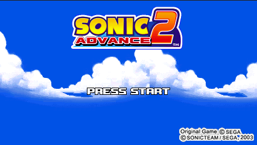

<h1 align="center">Sonic Advance 2</h1>

  

  
  
  
  
  

> :warning: **This project is not completed and still under active development**

This is a work in progress matching decompilation of Sonic Advance 2

It builds the following ROMs:
* [**sa2.gba**](https://datomatic.no-intro.org/index.php?page=show_record&s=23&n=0890) `sha1: 7bcd6a07af7c894746fa28073fe0c0e34408022d` (USA) (En,Ja,Fr,De,Es,It)
* [**sa2_europe.gba**](https://datomatic.no-intro.org/index.php?page=show_record&s=23&n=0900) `sha1: b0f64bdca097f2de8f05ac4c8caea2b80c5faeb1` (Europe) (En,Ja,Fr,De,Es,It)
* [**sa2_japan.gba**](https://datomatic.no-intro.org/index.php?page=show_record&s=23&n=0799) `sha1: dffd0188fc78154b42b401398a224ae0713edf23` (Japan) (En,Ja,Fr,De,Es,It)
* [**sa2_japan_vc.gba**](https://datomatic.no-intro.org/index.php?page=show_record&s=23&n=x380) `sha1: 2aa6ee2cf2b0ebfafbea6d6d24165b252a7e329e` (Japan) (En,Ja,Fr,De,Es,It) (Virtual Console)
* [**sa2_beta.gba**](https://datomatic.no-intro.org/index.php?page=show_record&s=23&n=x149) `sha1: 3368642fc4157824af63367e2a685b7d6ee9b09d` (USA) (Beta) (2002-10-25)

It can also build:
* **sa2.sdl** `make sdl` (Linux/MacOS SDL 64bit port)
* **sa2.sdl_win32.exe** `make sdl_win32` (Windows SDL 64bit port)
* :construction: **sa2.win32.exe** `make win32` (Win32 native port, not functional)

## Current state

- :tada: The build is 100% from C files with [~60 functions which currently don't match](./asm/non_matching)
- All assembly code extracted, disassembled, and decompiled by hand to their C equivilent
- All songs have been extracted, and documented as [matching MIDI files](./sound/songs/midi)
- All sprite animation frames have been [extracted to PNGs and are used to build the matching rom](./graphics/obj_tiles)
- All tilemaps (backgrounds) have been documented and [had their tiles extracted](./data/tilemaps)
- Most aspects of core game play have been documented, but >600 functions are still unnamed
- The game compiles to a widescreen port (*426x240*) for multiple platforms

## Sub games

Within the Sonic Advance 2 rom there are some "Sub games" which we have begun to decompile as part of this project. These sub games are automatically compiled and bundled during the main build process, as they are necessary to create a matching binary.

| Multiboot rom | Decompilation |
| --- | --- |
| [**mb_chao_garden.gba**](./chao_garden) |  |
| [**collect_rings.gba**](./multi_boot/roms/collect_rings/) |  |

## Setting up the repo

Please see follow [these instructions](./INSTALL.md)

## Community

Join us on [discord](https://discord.gg/vZTvVH3gA9) to get started in helping out

## Screenshots

## Notes

- The [Kirby & The Amazing Mirror](https://github.com/jiangzhengwenjz/katam/) decompilation uses a very similar codebase, as it was written by the same dev team (Dimps)
- https://decomp.me is a great resource for helping to create matching functions
- `ldscript.txt` tells the linker the order which files should be linked
- For more info, see the [FAQs section](https://zelda64.dev/games/tmc) of TMC

## Credits

- [JaceCear](https://github.com/JaceCear) for his dedication to understanding the internals of the graphics engine, writing [tools to extract this data](https://github.com/JaceCear/SA-Trilogy-Animation-Exporter), as well as massive effort in contributing towards the decompilation process, *and* setting up the PC ports
- Shout out to [@froggestspirit](https://github.com/froggestspirit) for the drive to set this project up
- Special thanks to [@normmatt](https://github.com/normmatt) for the initial repo setup and sounds disassembly

- [Pokemon Reverse Engineering Tools](https://github.com/pret) community for their help with the project, and tooling for GBA decompilations
- [Kermalis](https://github.com/Kermalis) for [their tool](https://github.com/Kermalis/VGMusicStudio) which was used to dump the game midis
- [琪姬](https://github.com/laqieer) for their exellent work [documenting](https://github.com/FireEmblemUniverse/fireemblem8u/pull/137) all the quirks of matching midis
